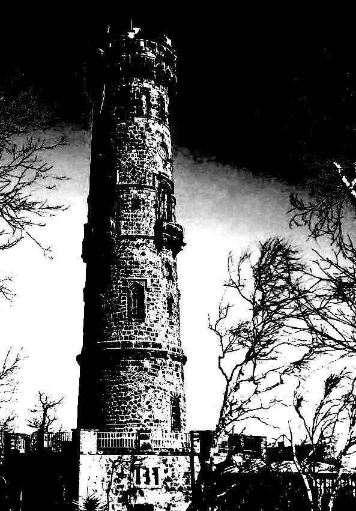
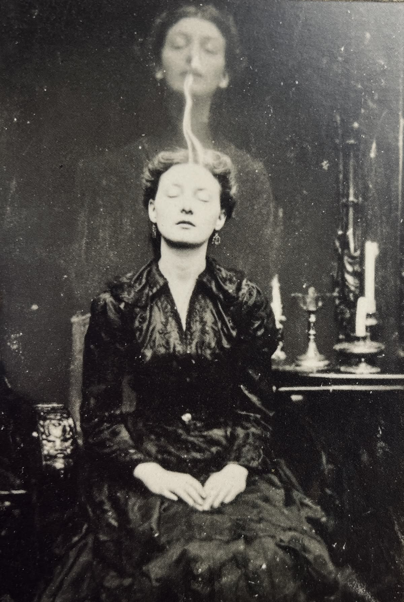
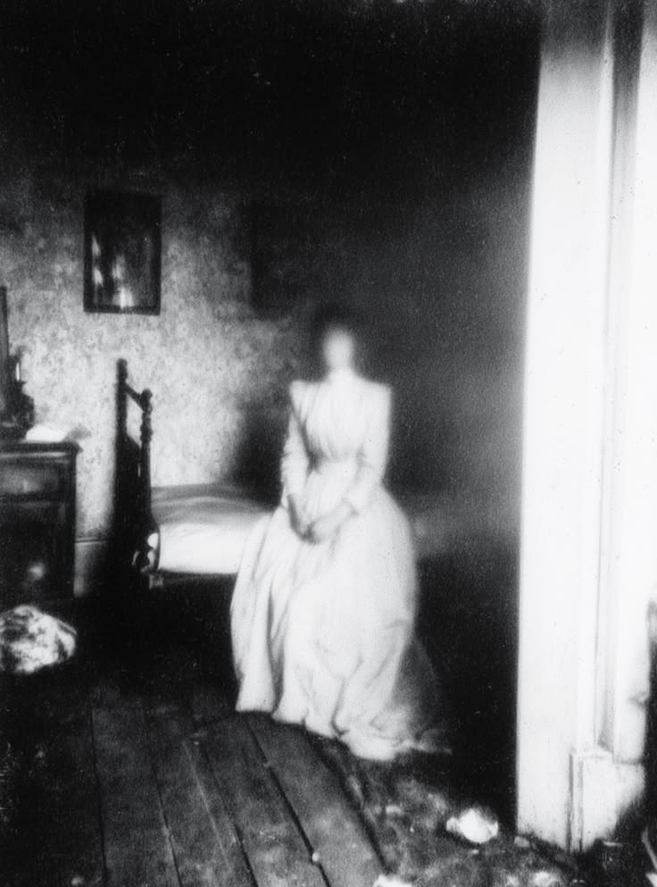
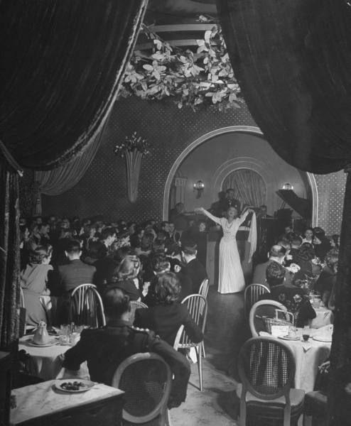
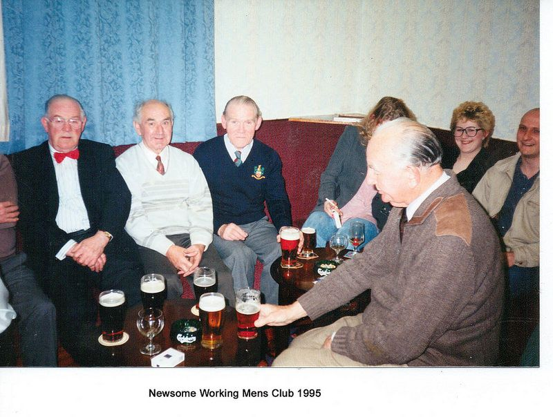
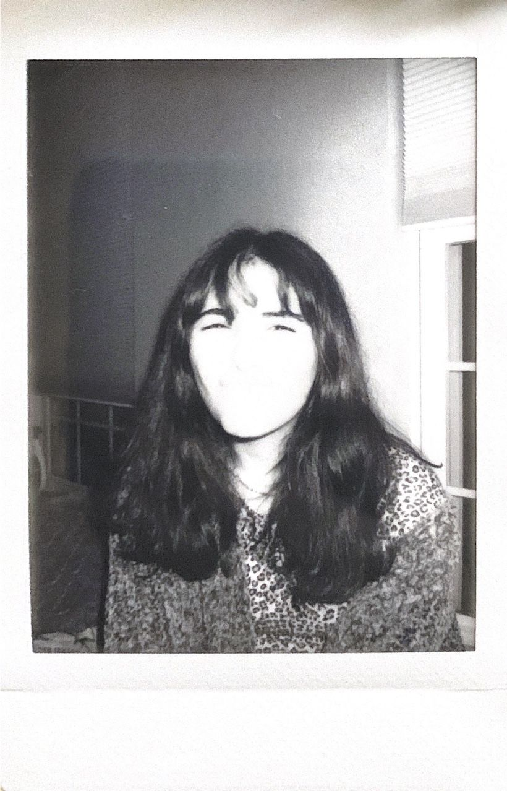

# Timeline

This chronology contains settled dates and explicit gaps. Do not invent exact dates inside clues until they are added here.

## Before the manor

- The Tower and its underground masonry predate Mourning Bluff Manor and every reliable record of the property. No one knows who built it or why.
- **Circa 1869:** A local antiquarian publishes an engraving of the isolated structure then standing on the property. Most of the Tower is demolished when construction of the manor begins, but its circular foundation and buried interior are incorporated into the new house.

*The surviving reproduction is usually captioned only “The Old Tower.” Its doorway and lower masonry do not agree with any known exterior wall of the completed manor. The engraving is the earliest confirmed image of the structure.*

## Nineteenth century

- **1871:** Miriam Bellweather commissions the manor around an older structure on the property.
- **Date unresolved:** Miriam's husband and children die.
- **Date unresolved:** Miriam begins dreaming of her children in rooms not yet present in the manor.
- **Date unresolved:** Miriam meets Dr. Lucius Ward.
- **1886:** Ward becomes First Fellow of the Rook.
- **Circa 1892:** Under Ward's direction, Miriam participates in photographic experiments intended to capture spirits, memories, or images arriving from unrealized futures. One formal exposure shows a second likeness rising above her. Another plate from the same series appears to show a woman seated in a bedroom that had not yet been built when the plate was catalogued.

*The Fellows disagreed over whether these were spirit photographs, double exposures, psychic projections, or images from another history. Ward treated them as evidence that Miriam could transmit visual information across possible futures.*

- **Late nineteenth century:** Miriam funds repeated additions to Gallows Way and permits the Fellows to establish the Rookery and Lower Circle.
- **Late nineteenth century:** The Fellows progress from collecting psychic testimony to coercive experimentation upon Readers.

## Twentieth century

- **1900:** Miriam Bellweather throws herself from the cliff behind Gallows Way during a winter storm. Her body is never recovered.
- **After 1900:** Ward gains control of the manor through disputed documents allegedly signed by Miriam.
- **Date unresolved:** The Fellows conduct their final large-scale experiment in the Lower Circle. Multiple deaths and the central transformation of Gallows Way follow.
- **1926, disputed:** A wedding photograph is catalogued as the marriage of Miriam's daughter, who would have been an adult by this date. Public records say that Miriam's children died decades earlier. The bride is not clearly visible, but the ballroom and several guests recur in other Bellweather and Fellows photographs. The photograph may record an unrealized history rather than an event that occurred in the accepted timeline.

- **1988:** A small team of scientists and psychical researchers receives temporary access to Mourning Bluff Manor. They install environmental sensors, conduct sleep and perception trials, and attempt to reproduce parts of the Fellows' work without acknowledging how much of it they understand. Their surviving group photograph shows an informal gathering shortly before the investigation deteriorates.

*The surviving copy was reprinted or remounted in 1995 beneath an unrelated social-club caption. Whether this was an archival mistake or a deliberate attempt to misidentify the researchers is unknown.*

- **1989:** A Polaroid taken during the modern investigation shows a young researcher whose face has been completely erased by overexposure, although the wall, clothing, and hair remain legible. Her name is missing from the team's surviving notes. Within weeks, the project ends and its members stop discussing the house publicly.

- **Later years unresolved:** The property is abandoned again, intermittently entered, and connected to further disappearances and accidents.

## Present day

- The Paranormal Investigator gathers the Cast at Gallows Way.
- The reason, advertised objective, and immediate inciting evidence remain unresolved.
